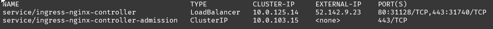

# Deployment to Azure Kubernetes Service using GitHub Actions

Github Actions gives you the flexibility to build automated workflows and deployments based on actions. There are now Kubernetes actions to get deployments to AKS. This is a simple recipe on how to use tye with Azure Kubernetes Service, Azure Container Service and GitHub Actions.

## Setting up AKS

The kubernetes cluster deployment can be deployed via the Azure portal or using the Azure CLI. It would be assumed that the cluster is deployed when implementing the recipe, however in this example Azure Container Registry (ACR) is used for storing the container images and as such integration is needed between these resources. The following deployment script ensures this is complete.

```bash
az aks create -n <CLUSTER NAME> -g <RESOURCE GROUP NAME> --generate-ssh-keys --attach-acr <ACR NAME> --node-count 3
```

## Sample Application

The sample application is based on the [frontend-backend](../../samples/frontend-backend) adding in an ingress so we can browse the application from a public IP address once deployed.

```yaml
name: microservice
registry: myregistry.azurecr.io
ingress:
  - name: ingress
    bindings:
      - port: 8080
    rules:
      - path: /
        service: frontend
      - path: /backend
        service: backend
services:
- name: frontend
  project: frontend/frontend.csproj
  replicas: 2
- name: backend
  project: backend/backend.csproj
```

Running locally using `tye run` works as we'd expect, browsing the tye dashboard you should see the applications and the ingress similar to the following.


## GitHub Action

Setting up the GitHub Action requires a few actions to compose the complete integration. 

First, the name of the AKS cluster, resource group, and container registry are set as Environment variables.

```yaml
env:
  AZURE_AKS_CLUSTER: myaksclustername
  AKS_RESOURCE_GROUP: myaksresourcegroup
  ACR_RESOURCE_URI: myregistry.azurecr.io
```

Next, ensure that Tye and its dependent .NET runtime are installed.

```yaml
- name: 🧰 Setup .NET
    uses: actions/setup-dotnet@v1.5.0
    with:
    dotnet-version: 6.0.100

- name: 🛠 Install Tye tools
    run: |
    dotnet tool install -g Microsoft.Tye --version "0.11.0-alpha.22111.1"
```

Using the name of the registry and the [Azure docker action](https://github.com/Azure/docker-login) to login to your registry. This step is needed prior to running the `build-push-deploy` command which will build and push the images to the registry. 

>:bulb: The username and password for authentication is stored in [secrets](https://help.github.com/en/actions/configuring-and-managing-workflows/creating-and-storing-encrypted-secrets) within the GitHub repository.

```yaml
- name: 🔐 Login to ACR
    uses: Azure/docker-login@v1  
    with:  
    login-server: ${{ env.ACR_RESOURCE_URI }}
    username: ${{ secrets.ACR_USER }}  
    password: ${{ secrets.ACR_PASSWORD }}
```

Next, we need to set the current context for our AKS cluster. Use [Azure aks-set-context action](https://github.com/Azure/aks-set-context) for this.

```yaml
- name: 📃 Set AKS context
    uses: azure/aks-set-context@v1
    with:
    creds: '${{ secrets.AZURE_CREDENTIALS }}'
    cluster-name: ${{ env.AZURE_AKS_CLUSTER }}
    resource-group: ${{ env.AKS_RESOURCE_GROUP }}
```

At this point we are ready to deploy the application. As pointed out previously there is an ingress service being used. 

When deploying manually you can use the `--interactive` option and the tye CLI will detect the configuration, inspect the cluster and ask/prompt for deployment. However, in this case it is automated and we need to deploy it as a part of the action.

We can just use a run action and apply the standard ingress from tye.

```yaml
- name: 🌐 Install ingress-nginx
    run: |
    kubectl apply -f https://aka.ms/tye/ingress/deploy
```

Finally, deploy the application!

>:bulb: adding the `-v Debug` for verbose logging

```yaml
- name: ☸ tye build-push-deploy
    run: |
    tye build-push-deploy -v Debug
```

### Complete GitHub Action

```yaml
name: Build and Deploy

on: [push]

env:
  AZURE_AKS_CLUSTER: myaksclustername
  AKS_RESOURCE_GROUP: myaksresourcegroup
  ACR_RESOURCE_URI: myregistry.azurecr.io

jobs:
  build:
    if: github.event_name == 'push' && contains(toJson(github.event.commits), '***NO_CI***') == false && contains(toJson(github.event.commits), '[ci skip]') == false && contains(toJson(github.event.commits), '[skip ci]') == false
    name: build-push-deploy
    runs-on: ubuntu-latest
    steps:
    - name: ✔ Checkout
      uses: actions/checkout@v2

    - name: 🧰 Setup .NET Core
      uses: actions/setup-dotnet@v1.5.0
      with:
        dotnet-version: 3.1.300

    - name: 🛠 Install Tye tools
      run: |
        dotnet tool install -g Microsoft.Tye --version "0.4.0-alpha.20371.1"

    - name: 🔐 Login to ACR
      uses: Azure/docker-login@v1  
      with:  
        login-server: ${{ env.ACR_RESOURCE_URI }}
        username: ${{ secrets.ACR_USER }}  
        password: ${{ secrets.ACR_PASSWORD }}

    - name: 📃 Set AKS context
      uses: azure/aks-set-context@v1
      with:
        creds: '${{ secrets.AZURE_CREDENTIALS }}'
        cluster-name: ${{ env.AZURE_AKS_CLUSTER }}
        resource-group: ${{ env.AKS_RESOURCE_GROUP }}

    - name: 🌐 Install ingress-nginx
      run: |
        kubectl apply -f https://aka.ms/tye/ingress/deploy

    - name: ☸ tye build-push-deploy
      run: |
        tye build-push-deploy -v Debug
```

## Viewing the deployed application

To find the public IP address to browse to, run the following.

```sh
kubectl get all -n ingress-nginx
```

Look for the `service/ingress-nginx-controller` with a type of `LoadBalancer`. The EXTERNAL-IP is the entry point for your application.


